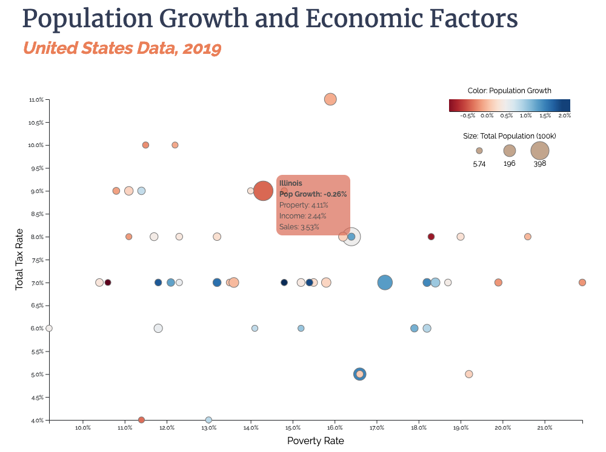

# D3 Scatter Plot

Visualizing population growth and various economic factors across states in the USA 2018.

This project is part of an assignment for MSiA 411.

The requirements are as follows:

Write a d3/javascript program that reads in the [states.csv](./states.csv) file and generates a scatter bubble plot with the following criteria:

- Size each state bubble by population.
- Color each bubble with a diverging color map to show population growth
- Assign poverty rate to the X axis
- Assign total of property, income and sales tax to the Y axis
- Be sure to include a legend for the bubble sizes, and for the color scale.

Be sure to include a descriptive title for each chart, axes, axis label for the numeric axis, tick marks, tick labels, grid lines, and a legend for the color encoding. Follow the design principles in the lecture notes for good chart design.

## Features

- Diverging color scale
- Animation on mouse hover
- Tooltips with background color matching points
- Tooltip text adjusted to maximize contrast
- Chart takes up full screen on window load
- Legend for continuous color scale
- Legend for bubble size

## Getting Started

This static visualization can be viewed by serving the file up for your browser via your favorite server engine.

Most simply, navigate to this directory and run:

```shell
python -m http.server
```

Then, open a browser to `localhost:8000` or whatever port the python server is running on.

## Samples


